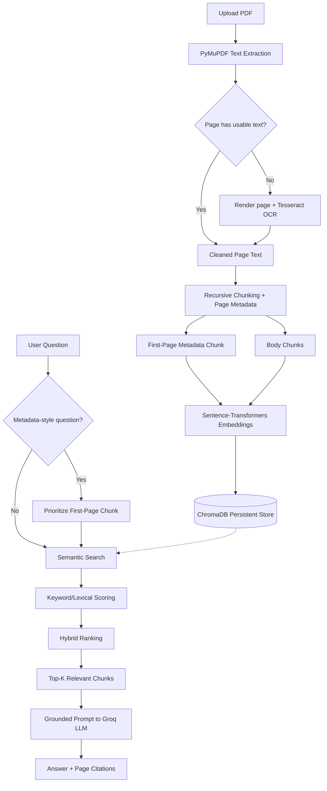

#  Research Paper Intelligence & Lightweight RAG System

A focused, locally-run application that lets you upload research papers (PDF)
and ask natural-language questions about them. Answers are generated **only**
from the retrieved content of the uploaded papers — the system will not
answer from outside/general knowledge, and it says so explicitly when an
answer isn't supported by the papers.


---

## 1. Problem Statement

Reading and cross-referencing multiple research papers is slow. Students and
researchers often need quick, trustworthy answers to questions like *"what
dataset did this paper use?"* or *"how does this method compare to that
one?"* — without the risk of an AI assistant hallucinating facts, datasets,
or citations that don't actually appear in the paper.

## 2. Objectives

- Let a user upload one or more PDF research papers (including scanned ones).
- Answer natural-language questions **strictly** from the uploaded content.
- Always show which file and page number an answer came from.
- Support single-paper and multi-paper (comparison) questions.
- Handle metadata questions (title, authors, abstract) reliably.
- Stay lightweight, explainable, and easy to run/demo locally.

## 3. Key Features

-  Multi-PDF upload, including scanned/image-only PDFs (automatic OCR).
-  Hybrid retrieval: semantic (embeddings) + keyword/lexical overlap.
-  Dedicated first-page metadata indexing for accurate title/author/abstract answers.
-  Grounded answer generation via Groq, with an explicit refusal message
  when information isn't found in the papers.
-  Page-level, de-duplicated citations for every answer.
-  Per-paper active/inactive selection so unrelated papers never contaminate an answer.
-  Structured, template-based paper summarization.
-  Duplicate-safe re-processing (re-uploading the same PDF replaces its old index, no duplicate chunks).
-  Friendly error handling for corrupted PDFs, missing API keys, empty questions, etc.

## 4. System Architecture

```
research-paper-rag/
│
├── data/papers/          # (optional) local copies of uploaded PDFs
├── chroma_db/            # persistent local vector database
├── src/
│   ├── config.py         # environment + tunable constants
│   ├── pdf_loader.py     # text extraction + automatic OCR fallback
│   ├── chunker.py        # recursive chunking + first-page metadata chunk
│   ├── vector_store.py   # ChromaDB wrapper + embeddings
│   ├── retriever.py      # hybrid semantic + keyword ranking
│   ├── document_manager.py # ingestion orchestration, dedup handling
│   └── rag.py            # grounded prompt building + Groq LLM calls
├── tests/
│   └── test_pipeline.py
├── app.py                # Streamlit UI
├── requirements.txt
├── .env.example
└── .gitignore
```

## 5. RAG Workflow



## 6. Technologies Used

| Layer            | Technology                          |
|-------------------|--------------------------------------|
| UI                | Streamlit                            |
| PDF text extraction | PyMuPDF                            |
| OCR               | Tesseract OCR + Pillow               |
| Embeddings        | sentence-transformers (`all-MiniLM-L6-v2`), local |
| Vector database   | ChromaDB (persistent, local)         |
| LLM               | Groq API (`llama-3.3-70b-versatile`) |
| Config/secrets    | python-dotenv                        |
| Testing           | pytest                               |

## 7. Installation

```bash
git clone <your-repo-url>
cd research-paper-rag
python -m venv venv
source venv/bin/activate   # Windows: venv\Scripts\activate
pip install -r requirements.txt
```

You also need the **Tesseract OCR** binary installed on your machine (this is
separate from the `pytesseract` Python package):

- **Ubuntu/Debian:** `sudo apt install tesseract-ocr`
- **macOS (Homebrew):** `brew install tesseract`
- **Windows:** install from the [Tesseract releases page](https://github.com/UB-Mannheim/tesseract/wiki) and ensure it's on your `PATH`.

## 8. Environment Variable Setup

```bash
cp .env.example .env
```

Edit `.env` and add your key from [console.groq.com/keys](https://console.groq.com/keys):

```
GROQ_API_KEY=your_real_key_here
```

The API key is **never** hard-coded and is loaded only via environment
variables (`python-dotenv` + `os.getenv`). `.env` is included in `.gitignore`.

## 9. How to Run

```bash
streamlit run app.py
```

Then open the local URL Streamlit prints (typically `http://localhost:8501`).

## 10. How PDF Processing Works

1. Each page is opened with PyMuPDF and normal text extraction is attempted.
2. If a page yields fewer than a small character threshold of usable text
   (a strong signal that it's a scanned/image page), the page is rendered
   to an image and processed with Tesseract OCR instead.
3. Extracted text is lightly cleaned (whitespace collapsed) and tagged with
   its page number and extraction method (`text` or `ocr`).

## 11. How OCR Works

- The page is rasterized via PyMuPDF (`get_pixmap`) at 2x zoom for better OCR accuracy.
- The resulting image is passed to `pytesseract.image_to_string`.
- OCR only runs on pages that actually need it — normal digital PDFs skip OCR entirely, keeping processing fast.

## 12. How Embeddings Work

- Every chunk's text is embedded locally using `all-MiniLM-L6-v2` via
  `sentence-transformers` — no data leaves your machine for embedding.
- This model is small (~80MB), fast on CPU, and accurate enough for
  paragraph-level semantic search.

## 13. How ChromaDB Works

- A single persistent Chroma collection (`research_papers`) stores every
  chunk's embedding, text, and metadata (`doc_id`, `filename`, `page_number`, `chunk_type`).
- `doc_id` is a hash of the filename + file bytes, so re-uploading an
  unchanged file is idempotent, and re-uploading a changed file cleanly
  replaces its old chunks (no duplicate/stale data).
- Queries use Chroma's `where` metadata filter to restrict search to only
  the currently selected/active papers — this is how document isolation is enforced.

## 14. How Retrieval Works (Hybrid Strategy)

1. **Semantic search:** the question is embedded and compared against
   stored chunk embeddings (cosine similarity) within the active `doc_ids`.
2. **Keyword scoring:** each semantic candidate is additionally scored by
   how many meaningful query terms it lexically contains.
3. **Combined ranking:** `score = 0.65 * semantic_similarity + 0.35 * keyword_overlap`.
4. **Metadata fast path:** if the question looks like a title/author/abstract
   question, the dedicated first-page chunk is retrieved directly and given
   top priority, in addition to normal semantic results.
5. The top-ranked chunks (default 5) are passed to the LLM as context.

## 15. How Groq Is Used

- The Groq API (OpenAI-compatible chat completion interface) is called with
  a strict system prompt instructing the model to answer **only** from the
  provided context and to explicitly say when information isn't present.
- The LLM layer (`src/rag.py`) is fully modular — swapping models only
  requires changing `GROQ_MODEL` in `src/config.py` or the `.env` file.

## 16. Example Questions

- "What is the main contribution of this paper?"
- "What dataset was used?"
- "What methodology was proposed?"
- "What are the limitations?"
- "What are the experimental results?"
- "Which paper performs better?"
- "Compare the methodologies used in these two papers."
- "What is the title?" / "Who are the authors?" / "What is the abstract?"

## 17. Project Limitations

- Retrieval quality depends on chunk boundaries; very long, poorly-structured
  PDFs may occasionally split related content across chunks.
- OCR accuracy depends on scan quality; heavily degraded scans may produce
  imperfect text.
- The keyword-scoring component is a simple lexical overlap, not a full BM25
  implementation, by design (kept lightweight and easy to explain in a viva).
- Answer quality is bounded by what Groq's hosted model can do with the
  provided context — it does not "read" the whole paper, only retrieved chunks.

## 18. Future Enhancements

- Add BM25-based lexical scoring for stronger hybrid ranking.
- Support additional file formats (DOCX, plain text).
- Add per-chunk highlighting of exactly which sentence supported an answer.
- Add a "confidence" indicator alongside each answer.
- Support export of a Q&A session or summary to PDF/Markdown.

---

## 19. Testing

Run the test suite with:

```bash
pytest tests/ -v
```

`tests/test_pipeline.py` covers:

1. Normal PDF extraction
2. Scanned PDF OCR (skipped automatically if Tesseract isn't installed)
3. Chunk creation
4. Embedding generation
5. ChromaDB insertion
6. Retrieval
7. First-page title retrieval
8. Author retrieval
9. Single-paper questions / document isolation
10. Multi-paper questions
11. Unsupported/out-of-scope questions
12. LLM answer generation (skipped automatically if `GROQ_API_KEY` isn't set)
13. Source/page citations

---

*Built as a lightweight, explainable, locally-runnable Retrieval-Augmented
Generation system — no unnecessary microservices, containers, or agent
frameworks.*
