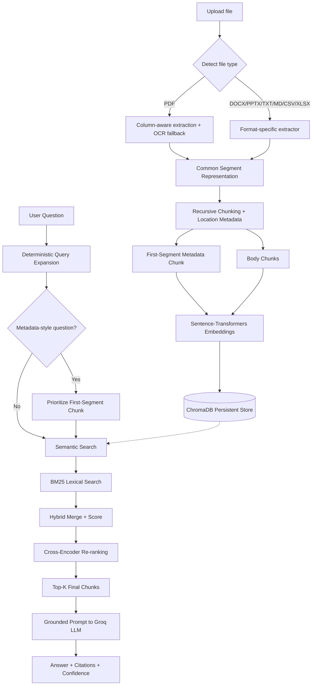

# 📚 Research Paper Intelligence & Lightweight RAG System

A locally-run application that lets you upload research papers and related
documents (PDF, DOCX, PPTX, TXT, MD, CSV, XLSX) and ask natural-language
questions about them. Answers are generated **only** from the retrieved
content of the uploaded files — never from outside/general knowledge — and
the system says so explicitly when an answer isn't supported.

This is a final-year Computer Science project built as a **hybrid
Retrieval-Augmented Generation (RAG)** system with a **FastAPI backend**
and a **React frontend**.

> **Architecture note:** this project originally shipped with a Streamlit
> UI. It has since been migrated to a proper client/server split — a
> FastAPI backend exposing the RAG pipeline over REST, and a React (Vite)
> frontend — while every underlying pipeline module (`src/`) is unchanged
> in behavior.

---

## 1. Problem Statement

Reading and cross-referencing multiple research papers and related
documents (slides, notes, spreadsheets of results) is slow. This tool lets
you ask direct questions and get grounded, cited answers instead of
manually searching PDFs — without the risk of an AI assistant inventing
facts, datasets, or citations that don't actually appear in the source.

## 2. Objectives

- Upload multiple documents across several formats and ask natural-language questions.
- Answer **strictly** from the uploaded content, with page/slide/section-level citations.
- Support single-document and multi-document (comparison) questions.
- Handle metadata questions (title, authors, abstract) reliably.
- Provide transparency (retrieved-chunk visibility, confidence indicators) for a defensible viva.
- Stay lightweight and explainable — no unnecessary infrastructure.

## 3. Key Features

- 📄 **Multi-format ingestion**: PDF (incl. scanned/OCR, two-column layouts), DOCX, PPTX, TXT, MD, CSV, XLSX — all converted into one common internal representation.
- 🔍 **Hybrid retrieval**: semantic embeddings + BM25 lexical search, merged and ranked.
- 🎯 **Cross-encoder re-ranking** on a small shortlist for higher-precision final results, with automatic fallback if the model can't load.
- ✂️ **Deterministic query expansion** for short/vague questions ("results?" → a fuller retrieval phrase) — no extra LLM calls.
- 🧩 Dedicated first-segment metadata indexing for accurate title/author/abstract answers.
- 🧠 Grounded answer generation via Groq, with retry/backoff for transient API errors and an explicit refusal message when information isn't found.
- 📌 Location-aware, de-duplicated citations (`Page 3`, `Slide 2`, `Section 1`, etc. depending on format).
- 🟢 **Estimated confidence indicator** (High/Medium/Low) based on retrieval evidence — clearly labeled as not a correctness guarantee.
- 🔍 **Retrieved-chunks debug panel** in the UI — shows exactly what was passed to the LLM.
- 🕘 **Question history** for the session, with one-click Markdown export.
- 📊 **Structured comparison tables** when multiple documents are selected and the question is comparative.
- 🎚️ Adjustable retrieval depth (Top-K) directly from the UI.
- 🗂️ Per-document active/inactive selection so unrelated documents never contaminate an answer.
- ♻️ Duplicate-safe re-processing.
- 📈 **Academic evaluation module**: Precision@K / Recall@K / Hit@K plus a retrieval-strategy ablation comparison, for your report.

## 4. System Architecture

```
research-paper-rag/
│
├── backend/                    # FastAPI server + RAG pipeline
│   ├── data/papers/             (optional local copies)
│   ├── chroma_db/                persistent local vector database
│   ├── src/
│   │   ├── config.py             environment + tunable constants
│   │   ├── pdf_loader.py         column-aware text extraction + OCR fallback
│   │   ├── document_loader.py    multi-format -> common "segment" representation
│   │   ├── chunker.py            recursive chunking + first-segment metadata chunk
│   │   ├── vector_store.py       ChromaDB wrapper + embeddings
│   │   ├── query_expansion.py    deterministic short-query expansion
│   │   ├── retriever.py          BM25 + semantic hybrid + cross-encoder re-rank
│   │   ├── document_manager.py   ingestion orchestration, dedup handling
│   │   └── rag.py                grounded prompts, Groq calls, confidence, comparison mode
│   ├── eval/eval_dataset.json    manually-editable evaluation test cases
│   ├── scripts/run_evaluation.py Precision@K/Recall@K/Hit@K + ablation runner
│   ├── tests/test_pipeline.py
│   ├── main.py                   FastAPI app (REST endpoints)
│   ├── requirements.txt
│   └── .env.example
│
├── frontend/                    # React (Vite) client
│   ├── src/
│   │   ├── App.jsx
│   │   ├── api.js                fetch wrapper for the backend API
│   │   ├── index.css
│   │   └── components/
│   │       ├── Sidebar.jsx       upload + active document selection
│   │       ├── AskTab.jsx        question box, Top-K slider, answer, confidence, debug panel
│   │       ├── SummarizeTab.jsx
│   │       ├── HistoryTab.jsx    session history + Markdown export
│   │       ├── ConfidenceBadge.jsx
│   │       └── DebugPanel.jsx
│   ├── package.json
│   ├── vite.config.js
│   └── .env.example
│
└── .gitignore
```

## 5. RAG Workflow



## 6. Technologies Used

| Layer                | Technology                                   |
|-----------------------|-----------------------------------------------|
| Frontend              | React 18 + Vite                               |
| Backend API           | FastAPI + Uvicorn                             |
| PDF text extraction   | PyMuPDF (column-aware block extraction)       |
| OCR                   | Tesseract OCR + Pillow                        |
| DOCX / PPTX / XLSX    | python-docx / python-pptx / openpyxl          |
| Embeddings            | sentence-transformers (`all-MiniLM-L6-v2`), local |
| Lexical retrieval     | rank_bm25 (BM25Okapi)                         |
| Re-ranking            | sentence-transformers CrossEncoder (`ms-marco-MiniLM-L-6-v2`) |
| Vector database       | ChromaDB (persistent, local)                  |
| LLM                   | Groq API (`llama-3.3-70b-versatile`)          |
| Config/secrets        | python-dotenv                                 |
| Testing               | pytest                                        |

## 7. Installation

### Backend

```bash
cd backend
python -m venv venv
source venv/bin/activate       # Windows: venv\Scripts\activate
pip install -r requirements.txt
```

You also need the **Tesseract OCR** binary installed (separate from the `pytesseract` package):

- **Ubuntu/Debian:** `sudo apt install tesseract-ocr`
- **macOS (Homebrew):** `brew install tesseract`
- **Windows:** install from the [Tesseract releases page](https://github.com/UB-Mannheim/tesseract/wiki) and ensure it's on your `PATH`.

### Frontend

```bash
cd frontend
npm install
```

## 8. Environment Variable Setup

```bash
cd backend
cp .env.example .env
```

Edit `backend/.env` and add your key from [console.groq.com/keys](https://console.groq.com/keys):

```
GROQ_API_KEY=your_real_key_here
```

The API key is **never** hard-coded and is loaded only via environment variables. `.env` is git-ignored.

The frontend only needs its own `.env` if your backend runs somewhere other than `http://localhost:8000`:

```bash
cd frontend
cp .env.example .env   # optional
```

## 9. How to Run

You need **two terminals** running at the same time.

**Terminal 1 — backend:**
```bash
cd backend
source venv/bin/activate        # if not already active
uvicorn main:app --reload --port 8000
```
The API is now live at `http://localhost:8000` (interactive docs at `http://localhost:8000/docs`).

**Terminal 2 — frontend:**
```bash
cd frontend
npm run dev
```
Open the URL Vite prints — typically `http://localhost:5173`.

## 10. How PDF Processing Works

1. Each page is opened with PyMuPDF. Text is extracted **block-by-block**
   and blocks are sorted into a left-column-then-right-column reading order
   (falls back to normal top-to-bottom order for single-column pages), so
   two-column academic PDFs no longer get their columns interleaved.
2. If a page yields fewer than a small character threshold of usable text
   (a strong signal it's scanned), the page is rendered to an image and
   processed with Tesseract OCR instead.
3. Extracted text is cleaned and tagged with its page number, extraction
   method (`text`/`ocr`), and a `location_label` (e.g. `"Page 3"`).

## 11. How Multi-Format Ingestion Works

Every file type is converted into the same internal "segment" shape by
`src/document_loader.py` before chunking — so the rest of the pipeline
(chunker, vector store, retriever, RAG) never needs per-format logic:

| Format | Segment granularity      | Citation label example       |
|--------|---------------------------|-------------------------------|
| PDF    | Page                       | `Page 5`                      |
| DOCX   | ~8-paragraph section       | `Section 2`                   |
| PPTX   | Slide                      | `Slide 7`                     |
| TXT/MD | ~1200-character block      | `Section 1`                   |
| CSV    | ~25-row group              | `Rows 26-50`                  |
| XLSX   | ~25-row group per sheet    | `Sheet 'Results' rows 1-25`   |

## 12. How Hybrid Retrieval Works

1. **Query expansion:** short/vague questions ("results?", "dataset?") are
   deterministically expanded to a fuller retrieval phrase (no LLM call) —
   see `src/query_expansion.py`. The *original* question is still what's
   sent to the LLM for answer generation.
2. **Semantic search:** the (possibly expanded) query is embedded and
   compared against stored chunk embeddings within the active documents.
3. **BM25 lexical search:** `rank_bm25` scores the same active documents'
   full chunk corpus for exact term matches (model names, dataset names,
   acronyms) that embeddings sometimes miss. BM25 accounts for term-frequency
   saturation and document-length normalization, which simple keyword
   overlap counting does not.
4. **Hybrid merge:** semantic and BM25 scores are min-max normalized and
   combined (`0.65 * semantic + 0.35 * bm25` by default).
5. **Cross-encoder re-ranking:** the top ~10 hybrid candidates are re-scored
   by a cross-encoder that reads the (question, chunk) pair jointly — more
   accurate than embedding comparison alone, and cheap since it only runs
   on a small shortlist. If the model can't load (no internet, etc.), the
   system automatically falls back to the hybrid ranking instead of crashing.
6. **Metadata fast path:** title/author/abstract-style questions prioritize
   the dedicated first-segment chunk built at indexing time.

## 13. How the Confidence Indicator Works

The badge shown next to each answer (🟢 High / 🟡 Medium / 🔴 Low) is
computed from the **average semantic similarity of the top retrieved
chunks** — it reflects how closely the evidence matches the question. It
is explicitly **not** a claim that the generated answer is factually
correct; always check the cited sources for anything important.

## 14. How Comparison Mode Works

When a question contains comparison language ("compare", "versus",
"difference between", etc.) **and** more than one document is selected,
the system switches to a comparison-specific prompt that asks the LLM to
answer as a Markdown table (one column per document), writing "Not found
in this paper" for any missing cell rather than inventing it.

## 15. How Groq Is Used (with Reliability Handling)

- The Groq API is called with a strict system prompt instructing the model
  to answer only from provided context.
- Transient errors (rate limits, timeouts, 5xx) are retried up to 3 times
  with exponential backoff (1.5s, 3s, 6s). Permanent errors (bad API key,
  invalid request) fail immediately with a clear message instead of
  retrying uselessly.
- The LLM layer is fully modular — swap models via `GROQ_MODEL` in `.env`.

## 16. Example Questions

- "What is the main contribution of this paper?"
- "What dataset was used?" / "dataset?" (short form, auto-expanded)
- "What methodology was proposed?"
- "What are the limitations?"
- "Compare the methodologies used in these documents."
- "What is the title?" / "Who are the authors?" / "What is the abstract?"

## 17. Academic Evaluation

Edit `backend/eval/eval_dataset.json` with real, manually-verified
questions once you've uploaded real papers (see the `_instructions` field
inside that file). Then run:

```bash
cd backend
python scripts/run_evaluation.py                    # hybrid mode, default K
python scripts/run_evaluation.py --k 3               # different K
python scripts/run_evaluation.py --mode bm25          # BM25-only ablation
python scripts/run_evaluation.py --answers            # also print generated answers for manual review
python scripts/run_evaluation.py --compare-modes      # runs semantic/bm25/no-rerank/hybrid and prints a comparison table
```

This reports **Hit@K**, **Precision@K**, and **Recall@K** per question and
averaged — directly usable numbers and tables for your final report.
Answer *correctness* is intentionally left to manual verification against
each question's `expected_key_facts`, since automatically grading free-text
answers reliably is out of scope for a lightweight, explainable system —
this is worth stating explicitly in your report as a design decision.

## 18. Project Limitations

- Retrieval quality depends on chunk boundaries; very long or poorly
  structured documents may occasionally split related content across chunks.
- OCR accuracy depends on scan quality.
- Cross-encoder re-ranking requires downloading a small model on first use;
  if there's no internet access at that moment, it silently falls back to
  hybrid ranking (this is by design, not a bug).
- Non-PDF "page numbers" are approximate groupings (e.g. DOCX "sections" are
  paragraph groups, not the document's actual heading structure).
- Confidence indicators reflect retrieval evidence strength, not verified factual correctness.

## 19. Future Enhancements

- Streaming answer tokens (Groq supports streaming) for a more responsive UI.
- Source-sentence highlighting within retrieved chunks.
- Cross-document knowledge relationships (paper → dataset → method).
- Contradiction detection across papers reporting different results on the same benchmark.

---

## 20. Testing

```bash
cd backend
pytest tests/ -v
```

Covers: normal PDF extraction, scanned PDF OCR (auto-skips if Tesseract
isn't installed), chunk creation, embedding generation, ChromaDB insertion,
retrieval, first-page title/author retrieval, document isolation, and LLM
answer generation + citations (auto-skips if `GROQ_API_KEY` isn't set).

---

## 21. Migration Notes (Streamlit → React/FastAPI)

If you're upgrading from the earlier Streamlit-only version:

- The vector database schema gained new metadata fields (`location_label`,
  `file_type`). **Click "Clear All Documents" in the sidebar once and
  re-process your files** after upgrading — old entries won't have these
  fields populated correctly.
- `app.py` (Streamlit) has been removed; the same pipeline is now served by
  `backend/main.py` (FastAPI) and driven by the `frontend/` React app.
- All `src/` module behavior is unchanged — only how it's exposed (HTTP API
  instead of an in-process Streamlit script) has changed.

---

*Built as a lightweight, explainable, locally-runnable Retrieval-Augmented
Generation system — no unnecessary microservices, containers, or agent
frameworks.*
